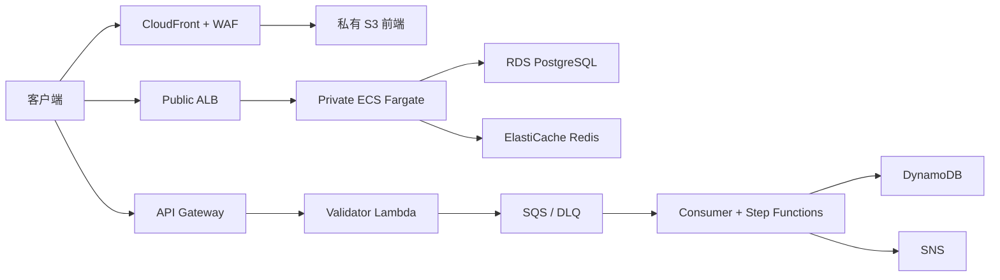

# AWS Terraform Enterprise Platform

面向 AWS 与 Terraform 系统学习的企业平台参考实现。项目用可复用模块连接静态前端、容器 API、异步 Serverless、三类数据存储、安全治理、可观测性、备份和 CI/CD，并为 dev、staging、prod 保持独立 State。

> 本仓库是完整的可部署参考实现，但没有替代组织级架构评审、威胁建模、容量测试、渗透测试和灾备演练。默认配置不会执行部署，高成本服务默认关闭。

## 架构概览



详细图见 [架构文档](docs/01-architecture.md) 与 [图表索引](docs/diagrams/README.md)。

## AWS 能力清单

| 领域 | 服务与组件 |
| --- | --- |
| 网络 | VPC、Public/Private Subnet、IGW、NAT Gateway、Route Table、Security Group、NACL、VPC Endpoint |
| 入口与计算 | ALB、ECS、Fargate、ECR、EC2、Auto Scaling |
| 数据 | RDS PostgreSQL、DynamoDB、ElastiCache Redis、S3 |
| 前端 | CloudFront、Route 53、ACM、WAF |
| Serverless | API Gateway、Lambda、SQS、SNS、EventBridge、Step Functions |
| 安全与配置 | Secrets Manager、Parameter Store、IAM、KMS |
| 运维治理 | CloudWatch、CloudTrail、AWS Config、GuardDuty、AWS Backup |
| CI/CD | GitHub Actions OIDC、CodeBuild、CodePipeline |

完整资源、默认开关和验证方式见 [服务参考](docs/10-service-reference.md)。

## 目录

```text
bootstrap/backend/      远程 State 基础设施
environments/           dev、staging、prod 独立根模块
modules/                9 个领域模块与组合模块
application/api/        FastAPI
application/worker/     容器 Worker
application/lambda/     Validator、Consumer、Step Worker、Layer
docs/                   架构、命令、安全、成本、灾备与学习文档
scripts/                安全包装的验证、Plan、Apply、Destroy、Smoke Test
tests/                  Terraform 与仓库契约测试
.github/workflows/      Terraform Check、Plan、安全扫描
```

## 前置条件

- Terraform `>= 1.15.0, < 1.16.0`
- AWS Provider `>= 6.0, < 7.0`
- Python 3.13
- Docker（应用构建可选）
- TFLint、Checkov、Trivy、ShellCheck、Markdownlint（完整质量门）
- 仅在 Plan/部署时需要 AWS Sandbox 凭证或 GitHub OIDC Role

不要在仓库中保存 Access Key、密码、`terraform.tfstate`、`tfplan`、`.env` 或真实 `backend.hcl`。

## 快速开始：只做本地检查

```bash
terraform version
terraform fmt -check -recursive
terraform -chdir=bootstrap/backend init -backend=false
terraform -chdir=bootstrap/backend validate
terraform -chdir=environments/dev init -backend=false
terraform -chdir=environments/dev validate
terraform test

python -m pip install -r application/api/requirements-dev.txt \
  -r application/lambda/requirements-dev.txt
python -m pytest
docker compose config
```

这些命令不会创建 AWS 资源。

## Bootstrap

```bash
cd bootstrap/backend
cp terraform.tfvars.example terraform.tfvars
terraform init -backend=false
terraform validate
terraform plan -out=tfplan
terraform show tfplan
# 只有获得明确授权并人工审查后：
# terraform apply tfplan
```

将输出的 Bucket、KMS ARN 写入各环境本地 `backend.hcl`。S3 Backend 使用 `use_lockfile = true`；不为新项目创建已弃用的 DynamoDB锁表。

## Dev Plan

```bash
cd environments/dev
cp backend.hcl.example backend.hcl
cp terraform.tfvars.example terraform.tfvars
# 替换 Backend 占位值；按预算显式开启功能
terraform init -backend-config=backend.hcl
terraform validate
terraform plan -var-file=terraform.tfvars -out=tfplan
terraform show tfplan
```

保存 Plan 可确保人工审查和实际 Apply 使用同一份变更集。不要把 Plan 上传到不受信任的位置。

## 应用验证

```bash
docker compose up --build
curl http://localhost:8000/health
curl http://localhost:8000/ready
curl http://localhost:8000/metrics
```

本地 Compose 提供 PostgreSQL 和 Redis；AWS API 可通过自选本地替身或测试账号配置。不要将本地静态检查误报为 AWS 部署验证。

## 销毁

先阅读 [销毁指南](docs/06-destroy-guide.md)。dev/staging 必须先生成销毁 Plan、人工审查，再以精确确认字符串执行包装脚本。脚本拒绝销毁 prod。Backend 最后单独处理，且 State 必须先备份。

## 成本警告

NAT Gateway、Interface Endpoint、ALB、RDS、Redis、持续运行的 Fargate/EC2、WAF、Config、GuardDuty、Backup、日志摄取即使低流量也可能收费。示例 tfvars 默认关闭这些能力。部署前使用 AWS Pricing Calculator，部署后使用 Cost Explorer/Budgets；见 [成本估算](docs/08-cost-estimation.md)。

## 安全警告

- S3、RDS、Redis 均不得公开。
- State 可能包含生成的数据库密码与 Redis Token，必须按高敏感数据保护。
- GitHub 使用 OIDC；不使用长期 Access Key。
- CodeStar Connection 创建后仍需用户在控制台授权。
- CloudTrail、Config、GuardDuty 可能已由组织统一管理，启用前确认所有权。

## 常见问题

**为什么默认不开启所有服务？**  
完整 Terraform 代码始终存在，但持续计费和账号级治理资源需要显式同意。

**为什么不用 Workspace 区分环境？**  
独立目录、State Key、变量和 CI Environment 更适合严格隔离与审批。

**为什么没有自动 Apply？**  
Plan 与 Apply 分离是安全边界；生产变更必须人工批准。

**CloudFront 证书为什么在 us-east-1？**  
CloudFront 只接受该区域的 ACM 证书；ALB 等区域性入口使用主区域证书。

## 文档索引

1. [实施计划](docs/00-implementation-plan.md)
2. [架构](docs/01-architecture.md)
3. [网络](docs/02-network-design.md)
4. [安全](docs/03-security-design.md)
5. [Terraform 命令](docs/04-terraform-commands.md)
6. [部署](docs/05-deployment-guide.md)
7. [销毁](docs/06-destroy-guide.md)
8. [故障排查](docs/07-troubleshooting.md)
9. [成本](docs/08-cost-estimation.md)
10. [灾备](docs/09-disaster-recovery.md)
11. [服务参考](docs/10-service-reference.md)
12. [学习路线](docs/11-learning-guide.md)
13. [验证报告](docs/12-validation-report.md)
14. [Checkov 例外登记](docs/13-checkov-exceptions.md)
