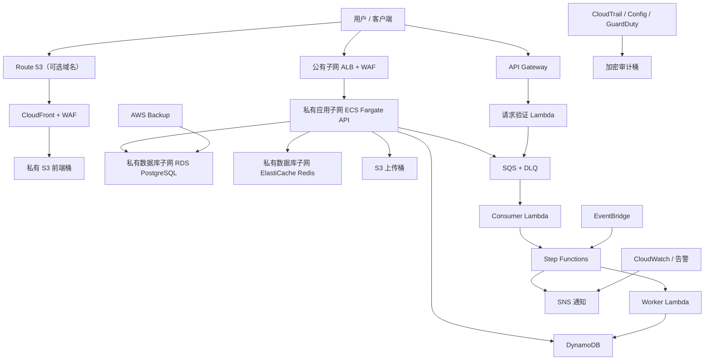

# AWS Terraform Enterprise Infrastructure Lab：实施计划

> 项目：`aws-terraform-enterprise-platform`  
> 默认区域：`ap-northeast-1`  
> 环境：`dev`、`staging`、`prod`  
> 文档状态：Phase 1 设计基线（2026-07-22）  
> 本阶段边界：仅完成分析与设计，不连接 AWS，不执行 `terraform apply` 或 `terraform destroy`。

## 1. 仓库检查结果

当前工作区是空的，未发现现有 Terraform、应用、文档或 Git 配置，因此：

- 不存在需要兼容或迁移的既有资源地址、State、模块接口；
- 不存在需要保留的用户代码，也没有执行删除或覆盖；
- 项目将从独立目录 `aws-terraform-enterprise-platform/` 开始；
- Phase 1 只创建本实施计划，Phase 2 才建立其余目录和基础文件；
- 在获得用户明确授权前，不读取本机 AWS 凭证，不调用 AWS API，不执行任何会改变真实云资源的命令。

## 2. 目标、范围与完成口径

### 2.1 目标

交付一套可学习、可审查、可按环境部署的 AWS 企业平台参考实现。代码必须是有效 Terraform 和可运行的最小应用，而不是伪代码。平台覆盖网络、静态前端、容器 API、异步处理、三类数据存储、安全治理、可观测性、备份和 CI/CD。

### 2.2 范围

- 40 个需求条目全部有真实 Terraform 配置；其中 Subnet、Route Table 等虽是 VPC 组件而非独立 AWS 产品，仍按独立能力实现和记录。
- 使用可复用本地模块，`dev`、`staging`、`prod` 使用独立根模块和独立 State，不用 Terraform Workspace 代替环境隔离。
- 提供 FastAPI、后台 Worker、3 类 Lambda、容器镜像、单元测试和最小集成测试。
- 提供 S3 远程 State Bootstrap、GitHub Actions、AWS CodeBuild/CodePipeline 示例和 GitHub OIDC IAM Role。
- 提供 13 项指定告警、日志、审计、配置记录、威胁检测和备份策略。
- 提供命令、部署、销毁、故障排查、成本、灾备、服务参考和学习路线文档，以及 7 张 Mermaid 图。

### 2.3 非目标

- 不在本任务中创建真实 AWS 账号、Hosted Zone、域名、证书或 GitHub 仓库配置。
- 不声称该参考实现未经组织级安全评审、渗透测试、容量测试和灾备演练即可直接生产使用。
- 不自动执行 `apply`、`destroy`、State 写操作或任何 AWS 变更。
- 不为满足“企业级”而引入 EKS、多区域主动-主动、Service Mesh 等未要求能力。

### 2.4 最终验收指标

| 领域 | 可验证结果 |
| --- | --- |
| Terraform | 全部模块有 `main.tf`、`variables.tf`、`outputs.tf`、`versions.tf`、`README.md` |
| 环境 | dev、staging、prod 各有独立 Backend 配置、变量示例和根模块 |
| 服务 | 40 个指定条目均有资源、用途、开关、成本与验证说明 |
| 应用 | FastAPI 和 Lambda 测试通过；容器可本地构建并响应健康检查 |
| 安全 | 无公开 S3/RDS/Redis、无硬编码凭证、敏感输出有标记、IAM 默认不使用全通配 |
| 质量 | 可用工具的 fmt、validate、test、lint、安全扫描和应用测试实际运行并记录 |
| 安全边界 | 未执行真实 Apply/Destroy，未读取或输出本机 AWS 凭证 |

## 3. 关键设计决策

### 3.1 版本策略

- Terraform Core 计划约束为 `>= 1.15.0, < 1.16.0`，统一开发机与 CI 的行为，并支持 S3 原生 Lockfile。
- AWS Provider 计划约束为 `~> 6.0`，允许同一主版本中的兼容更新；首次初始化生成并提交 `.terraform.lock.hcl`。
- Python 计划使用 3.13 系列；FastAPI 与运行时依赖使用精确或兼容上限锁定，并由依赖扫描持续检查。
- 具体补丁版本在 Phase 2/3 通过本机和 CI 实际解析后记录，不手写不存在的 Lock Hash。

### 3.2 State 与锁

- Bootstrap 使用独立本地 State，创建专用 S3 State Bucket 和 KMS Key；Bucket 开启版本控制、Public Access Block、TLS-only Bucket Policy 和生命周期策略。
- 各环境使用不同对象路径，例如 `states/dev/terraform.tfstate`，避免环境间 State 共享。
- S3 Backend 设置 `use_lockfile = true`。这是当前 Terraform 的推荐方案；DynamoDB 锁已弃用，因此新项目不把 DynamoDB 锁表作为默认实现。
- 为旧 Terraform 迁移预留文档说明，但不默认创建已弃用的锁表。业务 DynamoDB 表与 State 锁无关。
- Backend 参数通过 `backend.hcl.example` 和 `terraform init -backend-config=...` 传入，因为 Backend Block 不能引用普通变量。
- State IAM Policy 只允许指定 Bucket、State Key 和对应 `.tflock`；只有 Lockfile 需要 `DeleteObject`。

参考：

- [HashiCorp S3 Backend 文档](https://developer.hashicorp.com/terraform/language/backend/s3)
- [HashiCorp State Locking 文档](https://developer.hashicorp.com/terraform/language/state/locking)
- [HashiCorp Terraform 安装与当前稳定版](https://developer.hashicorp.com/terraform/install)
- [HashiCorp AWS Provider 文档](https://registry.terraform.io/providers/hashicorp/aws/latest/docs)

### 3.3 区域与证书

- 主资源位于 `ap-northeast-1`。
- CloudFront 使用的 ACM 证书必须由别名 Provider 在 `us-east-1` 创建。
- ALB 自定义域名证书在 `ap-northeast-1` 创建。
- `domain_name` 默认 `null`；未提供域名和 Hosted Zone ID 时使用 CloudFront/ALB/API Gateway 默认域名，并不创建 Route 53 Record 或 ACM Certificate。
- 域名能力采用开关，避免示例默认占用或假设用户真实域名。

### 3.4 环境隔离

| 项目 | dev | staging | prod |
| --- | --- | --- | --- |
| State | 独立 Key | 独立 Key | 独立 Key，审批保护 |
| NAT | 可关闭或单 NAT | 默认单 NAT | 每 AZ 一个 NAT |
| ECS desired count | 1 | 1 | 至少 2 |
| RDS Multi-AZ | 关闭 | 可选 | 开启 |
| Redis | 默认关闭 | 可选 | 开启并多 AZ |
| 治理服务 | 多数默认关闭 | 按需开启 | GuardDuty/Config/Trail/Backup 开启 |
| 删除保护 | 关闭，便于实验清理 | 可选 | 开启 |
| 日志保留 | 短 | 中 | 长 |

prod 默认值体现生产建议，但不会被自动部署。所有环境都必须经过 Plan、安全扫描、成本检查和人工批准。

### 3.5 高成本资源开关

除需求明确列出的开关外，增加 `enable_rds`、`enable_alb`、`enable_cloudfront`、`enable_interface_endpoints`、`enable_enhanced_monitoring` 和 `enable_performance_insights`。这样完整代码始终存在，但低成本 dev 示例可关闭持续计费资源。

### 3.6 IAM 与凭证

- ECS execution role、ECS task role、每类 Lambda role、EC2 role、Config role、Flow Logs role、Backup role、CodeBuild role、CodePipeline role和 GitHub OIDC role 分离。
- 应用 Role 只允许访问对应 Bucket 前缀、Queue、Topic、Table、Secret 或 Parameter ARN。
- GitHub OIDC Trust Policy 限制到明确的组织、仓库、分支或 Environment；不使用长期 Access Key。
- 运行时 Secret 由 Secrets Manager 注入；非敏感配置由 Parameter Store 注入。示例 tfvars 不包含密码。

## 4. 总体架构



### 4.1 网络边界

- VPC 跨 2 个 AZ；CIDR 默认 `10.20.0.0/16`。
- 每 AZ 各 1 个 Public、Private Application、Private Database Subnet，共 6 个。
- Public Subnet 仅放置 ALB、NAT Gateway 和可选公有入口；EC2 示例也优先放 Private Application Subnet，不开放 SSH，使用 SSM。
- ECS、Lambda VPC ENI 和可选 EC2/ASG 位于 Private Application Subnet。
- RDS 与 Redis 位于 Private Database Subnet，Database Route Table 不配置到 IGW 的默认路由。
- S3/DynamoDB 使用 Gateway Endpoint；ECR API、ECR DKR、CloudWatch Logs、Secrets Manager 使用 Interface Endpoint。ECS 无 NAT 拉取镜像还需要 S3 Gateway Endpoint。
- NACL 提供清晰的子网边界示例，Security Group 作为主要有状态控制。数据库只接受来自应用 Security Group 的端口访问。

### 4.2 同步流量

1. 浏览器通过 Route 53（可选）解析 CloudFront。
2. WAF 检查请求；CloudFront 只通过 OAC 读取私有前端 Bucket。
3. API 请求经 ALB 到 Private Subnet 的 ECS Task。
4. ECS 使用 Security Group 引用访问 RDS/Redis，并通过 VPC Endpoint 或受控出站访问 AWS 服务。

### 4.3 异步流量

1. API Gateway 调用请求验证 Lambda。
2. Validator 校验 JSON、生成关联 ID，将消息发送到 SQS。
3. SQS Event Source Mapping 调用 Consumer；失败按 Redrive Policy 进入 DLQ。
4. Consumer 启动 Step Functions execution。
5. State Machine 调用 Worker Lambda 完成处理，写入 DynamoDB，并通过 SNS 发布结果。
6. EventBridge 提供定时或事件驱动入口；CloudWatch 监控错误、节流、队列深度和 DLQ。

### 4.4 容器与可选 EC2

- ECR 保存 API/Worker 镜像并配置 Lifecycle Policy。
- ECS Fargate 承载默认 API；Service Auto Scaling 根据 CPU、内存和请求量调整 Task 数。
- EC2 + Launch Template + Auto Scaling Group 是独立、默认关闭的学习模块，用于展示传统弹性计算，并通过 SSM 管理，不与 ECS Capacity Provider 混用。

## 5. 服务依赖关系

| 层 | 服务/组件 | 主要上游 | 主要下游 | 关键依赖与约束 |
| --- | --- | --- | --- | --- |
| 网络 | VPC、Subnet、IGW、Route Table、NACL | 无 | 全部 VPC 资源 | 先于 ALB/ECS/RDS/Redis/EC2 |
| 出站 | NAT Gateway | Public Subnet、EIP、IGW | Private App Route | prod 每 AZ，dev 可单个或关闭 |
| 私网 AWS API | VPC Endpoint | VPC、Route Table、Endpoint SG | ECS/Lambda/EC2 | S3/DDB 为 Gateway；ECR/Logs/Secrets 为 Interface |
| 静态前端 | S3 | KMS、日志桶 | CloudFront OAC | Block Public Access，版本控制，加密，生命周期 |
| CDN/DNS | CloudFront、ACM、Route 53、WAF | S3、us-east-1 Provider | 浏览器 | 自定义域名全部可选 |
| 容器入口 | ALB | Public Subnet、SG、ACM | ECS Target Group | HTTPS 可选，HTTP 重定向仅在证书存在时启用 |
| 容器运行 | ECS/Fargate/ECR | VPC、IAM、Logs、Secrets、SSM | RDS/Redis/DDB/S3/SQS | Task 在 Private App Subnet |
| 传统计算 | EC2/ASG | VPC、IAM、KMS、SSM | CloudWatch | 默认关闭，无 SSH 入站 |
| 关系数据 | RDS PostgreSQL | DB Subnet、KMS、Secret、SG | ECS | 不公开，备份/删除保护按环境 |
| NoSQL | DynamoDB | KMS | ECS/Lambda/Step Functions | On-demand、PITR、TTL、GSI、可选 Stream |
| 缓存 | ElastiCache Redis | DB Subnet、KMS、SG、Secret | ECS | 默认关闭，TLS/Auth Token |
| Serverless 入口 | API Gateway | CloudWatch | Validator Lambda | Stage 日志、5XX 告警 |
| 消息 | SQS/DLQ/SNS | KMS、IAM | Lambda/告警/通知 | Queue Policy、Redrive、DLQ Alarm |
| 编排 | EventBridge/Step Functions | IAM、SQS Consumer | Worker Lambda/DDB/SNS | 最小权限执行 Role |
| 可观测性 | CloudWatch | 各工作负载 | SNS | Dashboard、Logs、13 类告警 |
| 审计治理 | CloudTrail/Config/GuardDuty | S3、KMS、IAM | SNS/审计人员 | 开关控制，prod 建议启用 |
| 备份 | AWS Backup | KMS、IAM | RDS/受支持资源 | Vault Lock 不作为默认，避免不可逆配置 |
| CI/CD | GitHub Actions/OIDC、CodeBuild、CodePipeline | GitHub、IAM、S3/ECR | Terraform Plan/镜像 | 云端 Code* 默认关闭 |

## 6. 模块边界与接口原则

模块按单一领域划分，不让一个“巨型模块”管理整个平台。根环境负责连接模块。

| 模块 | 主要资源 | 关键输入 | 关键输出 |
| --- | --- | --- | --- |
| `networking` | VPC、6 Subnet、IGW、NAT、Routes、NACL、Flow Logs | CIDR、AZ、NAT 策略 | VPC/Subnet/Route IDs |
| `vpc-endpoints` | Gateway/Interface Endpoints | VPC、Routes、Subnets、开关 | Endpoint IDs |
| `kms` | 分用途 KMS Keys/Alias | 环境、管理员 Role | Key ARNs |
| `iam` | 运行 Role、Policies、OIDC | 资源 ARNs、GitHub Subject | Role ARNs |
| `security` | ALB/App/DB/Redis/Endpoint SG | VPC、端口 | SG IDs |
| `s3` | 前端、上传、访问日志桶 | KMS、生命周期 | Bucket ARNs/域名 |
| `cloudfront` | Distribution、OAC | 前端桶、证书、WAF | Distribution ID/域名 |
| `route53` | Records | Zone、域名、目标 | Record FQDN |
| `waf` | Regional/CloudFront Web ACL | Scope、规则开关 | ACL ARNs |
| `ecr` | Repositories、Lifecycle | 名称、保留数 | Repository URLs |
| `alb` | ALB、Target Group、Listeners、Logs | Public Subnets、SG、证书 | ALB/TG ARN、DNS |
| `ecs` | Cluster、Task、Service、Scaling、Logs | Image、Roles、Subnets、Secrets | Cluster/Service 名称 |
| `ec2` | LT、ASG、Instance Profile | AMI/类型/Subnets/开关 | ASG 名称 |
| `rds` | DB、Subnet/Parameter Group、Secret | Class、Multi-AZ、KMS | Endpoint、Secret ARN |
| `dynamodb` | Table、TTL、GSI、Stream | 表名、Stream 开关 | Table/Stream ARN |
| `elasticache` | Replication Group、Subnet/Parameter Group | 节点、Multi-AZ、Token | Primary Endpoint |
| `api-gateway` | HTTP API、Routes、Stage、Logs | Lambda ARN | Endpoint/Stage |
| `lambda` | Functions、Layer、Mappings、Logs | 包路径、Role、环境变量 | Function ARNs |
| `messaging` | SQS、DLQ、SNS、Policies | KMS、阈值 | Queue/Topic ARNs |
| `step-functions` | State Machine、Role、Logs | Worker/DDB/SNS ARNs | State Machine ARN |
| `eventbridge` | Rule、Target、Role | Schedule/Event Pattern | Rule ARN |
| `monitoring` | Dashboard、Alarms、Alarm Topic | 各资源维度、阈值 | Dashboard/Topic |
| `cloudtrail` | Trail、加密日志桶 | KMS、开关 | Trail/Bucket ARN |
| `config` | Recorder、Delivery、Rules | Bucket、Role、开关 | Recorder 名称 |
| `guardduty` | Detector | 开关 | Detector ID |
| `backup` | Vault、Plan、Selection、Role | KMS、资源 ARNs | Vault/Plan ID |
| `cicd` | OIDC/CodeBuild/CodePipeline | GitHub 条件、Artifact Bucket | Role/Pipeline ARN |

所有模块输入/输出都有 description；可空输入显式 `nullable`；敏感值显式 `sensitive`；validation 只验证模块能可靠判断的条件。

## 7. 计划目录结构

```text
aws-terraform-enterprise-platform/
├── AGENTS.md
├── README.md
├── Makefile
├── .editorconfig
├── .gitignore
├── .markdownlint.json
├── .pre-commit-config.yaml
├── .tflint.hcl
├── docker-compose.yml
├── bootstrap/
│   ├── README.md
│   └── backend/
│       ├── main.tf
│       ├── variables.tf
│       ├── outputs.tf
│       ├── versions.tf
│       └── terraform.tfvars.example
├── environments/
│   ├── dev/
│   ├── staging/
│   └── prod/
│       # 每个环境：backend.tf、backend.hcl.example、main.tf、
│       # providers.tf、variables.tf、outputs.tf、locals.tf、
│       # terraform.tfvars.example、versions.tf、README.md
├── modules/
│   ├── networking/
│   ├── vpc-endpoints/
│   ├── kms/
│   ├── iam/
│   ├── security/
│   ├── s3/
│   ├── cloudfront/
│   ├── route53/
│   ├── waf/
│   ├── ecr/
│   ├── alb/
│   ├── ecs/
│   ├── ec2/
│   ├── rds/
│   ├── dynamodb/
│   ├── elasticache/
│   ├── api-gateway/
│   ├── lambda/
│   ├── messaging/
│   ├── eventbridge/
│   ├── step-functions/
│   ├── monitoring/
│   ├── cloudtrail/
│   ├── config/
│   ├── guardduty/
│   ├── backup/
│   └── cicd/
├── application/
│   ├── api/
│   ├── worker/
│   └── lambda/
│       ├── validator/
│       ├── consumer/
│       ├── step-worker/
│       └── layer/
├── docs/
│   ├── 00-implementation-plan.md
│   ├── 01-architecture.md
│   ├── 02-network-design.md
│   ├── 03-security-design.md
│   ├── 04-terraform-commands.md
│   ├── 05-deployment-guide.md
│   ├── 06-destroy-guide.md
│   ├── 07-troubleshooting.md
│   ├── 08-cost-estimation.md
│   ├── 09-disaster-recovery.md
│   ├── 10-service-reference.md
│   ├── 11-learning-guide.md
│   ├── 12-validation-report.md
│   └── diagrams/
├── scripts/
│   ├── bootstrap.sh
│   ├── validate.sh
│   ├── plan.sh
│   ├── apply.sh
│   ├── destroy.sh
│   ├── smoke-test.sh
│   └── cost-check.sh
├── tests/
│   ├── terraform/
│   └── integration/
└── .github/workflows/
    ├── terraform-check.yml
    ├── terraform-plan.yml
    └── security-scan.yml
```

## 8. 分阶段实施与验证门

任何阶段失败时先修复该阶段，不把失败隐藏到后续阶段。

### Phase 1：分析与设计

实施：

- 检查仓库；
- 固化范围、架构、依赖、目录、风险、成本和假设；
- 创建本文件。

验证：

- 文件存在且 UTF-8 可读；
- 需求中的 40 个条目、3 个环境、7 类图和 13 类告警均进入计划；
- 无 AWS/API/Apply 操作。

### Phase 2：项目骨架

实施：

- 创建根级规范、Makefile、静态配置、环境根模块、模块占位结构和 CI 工作流；
- “占位结构”只在本阶段短暂存在，后续必须填充真实资源，最终不交付空模块；
- 建立公共命名和 Tags：`Name`、`Project`、`Environment`、`ManagedBy`、`Owner`、`CostCenter`、`Repository`。

验证：

- 目录清单脚本无缺项；
- YAML、Markdown、Shell 和 HCL 能被各自解析/格式化；
- Git Ignore 覆盖 State、`.terraform`、Plan、日志、`.env`、缓存和私钥。

### Phase 3：Backend Bootstrap

实施：

- S3、KMS、版本控制、公共访问阻止、TLS Policy、最小权限 Policy；
- 输出 Bucket、Region、KMS ARN 和 Backend 初始化示例；
- 环境 Backend 使用部分配置及 S3 Lockfile。

验证：

```bash
terraform fmt -recursive
terraform -chdir=bootstrap/backend init -backend=false
terraform -chdir=bootstrap/backend validate
```

不执行 Apply。记录 Terraform 和 Provider 实际版本。

### Phase 4：核心网络与安全

实施：

- networking、vpc-endpoints、kms、iam、security；
- 网络 CIDR/数量 validation、NAT 策略、NACL、Flow Logs、Endpoint Policy；
- 最小权限角色和 Security Group 引用。

验证：

- 各模块 `terraform init -backend=false` 与 `terraform validate`；
- `terraform test` 验证 6 子网、NAT 数量、数据库无公网路由和开关行为；
- Checkov/TFLint 审查网络、加密、IAM 与日志。

### Phase 5：应用与数据层

实施：

- S3/CloudFront/Route 53/ACM/WAF；
- ECR/ALB/ECS/Fargate/EC2/ASG；
- RDS/DynamoDB/Redis；
- API Gateway/Lambda/Layer/SQS/SNS/EventBridge/Step Functions。

验证：

- 模块及环境根模块 validate/test；
- 静态断言确认私有 S3、RDS `publicly_accessible = false`、Redis私网、加密和删除保护策略；
- 生成 dev Plan 只在用户提供测试凭证并单独授权 Plan 后进行。

### Phase 6：运维与治理

实施：

- CloudWatch Dashboard 与全部告警；
- CloudTrail、Config、GuardDuty、Backup、WAF、访问日志、Flow Logs；
- 告警维度从模块输出传入，不硬编码资源 ARN。

验证：

- 13 类告警资源均存在；
- Trail 开启 Log File Validation；
- 日志桶加密并阻止公开访问；
- 治理开关在禁用时不会留下悬空引用。

### Phase 7：应用代码

实施：

- FastAPI 的 `/health`、`/ready`、`/api/v1/items`、`/api/v1/jobs`、`/metrics`；
- PostgreSQL、Redis、DynamoDB、S3、SQS 的最小真实适配器；
- JSON 结构化日志和凭证脱敏；
- Validator、Consumer、Step Worker Lambda 和共享 Layer；
- Dockerfile、Compose、本地替身和单元测试。

验证：

```bash
python -m pytest
docker compose config
docker build application/api
```

Docker Engine 不可用时明确记录为未运行，不把配置解析等同于镜像构建。

### Phase 8：CI/CD 与质量检查

实施：

- GitHub Actions：Terraform Check、PR Plan Artifact、安全扫描；
- GitHub OIDC；CodeBuild/CodePipeline 默认关闭；
- Makefile 和脚本统一入口，危险命令需要明确环境与确认参数。

验证：

```bash
terraform fmt -check -recursive
terraform test
tflint --recursive
checkov -d .
trivy fs .
shellcheck scripts/*.sh
markdownlint .
python -m pytest
```

对所有未安装工具分别记录“未运行”和安装方式。

### Phase 9：文档

实施：

- 完成 README 和 01–11 文档；
- 在 `docs/diagrams/` 或相应文档中提供总体、VPC、ECS、Serverless、CI/CD、State、安全日志 7 张 Mermaid 图；
- 服务参考覆盖所有配置条目，命令文档覆盖作用、场景、参数、风险、实践和常见错误。

验证：

- Markdownlint；
- 链接与文件索引检查；
- 服务、变量、模块、告警、图表的需求矩阵无缺项；
- 文档示例命令与实际路径一致。

### Phase 10：最终审查

实施：

- 执行自动检查并人工审查安全、成本、模块接口、文档一致性；
- 生成 `docs/12-validation-report.md` 和最终交付报告。

验证分类必须严格使用：

- 已运行并成功；
- 已运行但失败；
- 因工具缺失未运行；
- 因需要 AWS 凭证未运行；
- 因安全限制未执行。

## 9. 告警实施矩阵

| 告警 | 指标/依据 | 默认动作 |
| --- | --- | --- |
| ALB 5XX | `HTTPCode_ELB_5XX_Count` | SNS Alarm Topic |
| ECS CPU | `AWS/ECS CPUUtilization` | SNS |
| ECS Memory | `AWS/ECS MemoryUtilization` | SNS |
| ECS Running Task Count | Container Insights 或目标数表达式 | SNS |
| Lambda Errors | `AWS/Lambda Errors` | SNS |
| Lambda Throttles | `AWS/Lambda Throttles` | SNS |
| API Gateway 5XX | `AWS/ApiGateway 5xx` | SNS |
| SQS Queue Depth | `ApproximateNumberOfMessagesVisible` | SNS |
| DLQ Message Count | DLQ `ApproximateNumberOfMessagesVisible` | SNS |
| RDS CPU | `AWS/RDS CPUUtilization` | SNS |
| RDS Free Storage | `AWS/RDS FreeStorageSpace` | SNS |
| Redis CPU | `AWS/ElastiCache EngineCPUUtilization` | SNS |
| NAT Gateway Errors | `ErrorPortAllocation` 与丢包指标 | SNS |

资源关闭时相应告警也关闭，避免无效维度与 Terraform 引用错误。阈值按环境变量化。

## 10. 成本风险与控制

不在文档中虚构固定价格；实际费用需在部署前使用 AWS Pricing Calculator，并在部署后使用 Cost Explorer/Budgets 核对。

| 风险 | 即使空闲也可能收费 | 控制 |
| --- | --- | --- |
| NAT Gateway | 是 | dev 可关闭或单 NAT；优先 Gateway Endpoint；说明跨 AZ 流量成本 |
| Interface Endpoint | 是，按 AZ/小时及流量 | `enable_interface_endpoints`；按需要开启 |
| ALB | 是，按小时及 LCU | 可关闭；dev 单 ALB；及时销毁 |
| RDS | 是，实例与存储/备份 | 小实例、单 AZ、`enable_rds`、短备份保留 |
| ElastiCache | 是 | dev 默认关闭，小节点，非生产单节点 |
| ECS Fargate | Task 运行期间 | desired count 1；实验后缩容/销毁 |
| EC2/ASG | 实例/EBS 期间 | 默认关闭，最小类型，SSM 定时停止建议 |
| CloudFront/WAF | 请求/流量；WAF 规则有固定项 | dev WAF 默认关闭，限制规则数量 |
| CloudWatch Logs/指标 | 摄取、存储、自定义指标 | dev 短保留；控制日志级别；不记录负载正文 |
| CloudTrail/Config/GuardDuty | 事件、记录、分析 | dev 默认关闭，prod 建议启用 |
| AWS Backup | 备份存储与跨区复制 | dev 默认关闭；保留期变量化 |
| CodeBuild/CodePipeline | 构建时长/流水线 | 默认关闭；本地/GitHub Actions 静态检查优先 |
| S3/KMS/ECR/DynamoDB/Lambda/SQS/SNS | 通常按存储、请求或调用 | Lifecycle、On-demand、保留上限、最小调用 |
| 数据传输 | 跨 AZ、互联网、NAT、CloudFront | 设计时核对路径，避免无意跨 AZ/NAT |

低成本 `dev/terraform.tfvars.example` 计划默认：

- 单 AZ 容错仍保留 2 AZ 子网，但单 NAT 或关闭 NAT；
- `ecs_desired_count = 1`；
- RDS Single-AZ、小实例、最短允许备份保留；
- Redis、EC2、GuardDuty、Config、Backup、Code*、自定义域名默认关闭；
- 较短日志保留；
- WAF 和 Interface Endpoint 由用户显式选择；
- 不提供任何真实密码、账号、域名或 ARN。

## 11. 安全与运维风险

| 风险 | 影响 | 缓解/验收 |
| --- | --- | --- |
| State 含敏感值 | 凭证或连接信息泄露 | S3/KMS、版本控制、最小权限、禁止日志输出 State |
| IAM 过宽 | 横向移动或数据泄露 | 按角色拆分、资源级 ARN、扫描 `Action/Resource = *` |
| Public 数据面 | 数据库/对象暴露 | S3 PAB、RDS 非公开、Redis 私网、SG 引用 |
| Secret 出现在 Plan/日志 | CI Artifact 泄露 | sensitive 标记、Plan 摘要过滤、不上传 JSON Plan |
| SQS 重复投递 | 重复处理 | 幂等键、DynamoDB 条件写、可见性超时、DLQ |
| Lambda 与 Step Functions 重试叠加 | 重复执行/成本上升 | 明确重试层级、指数退避、最大尝试次数 |
| 单 NAT 的 AZ 故障 | dev 出站不可用 | 接受 dev 风险；prod 每 AZ NAT |
| 无 NAT 时依赖不全 | ECS 拉镜像或 API 调用失败 | ECR API/DKR、S3、Logs、Secrets Endpoint 完整性测试 |
| CloudFront 证书区域错误 | Distribution 创建失败 | 强制 us-east-1 Provider Alias |
| 域名所有权未知 | ACM 验证阻塞 | 默认不创建域名资源；显式输入 Zone/Domain |
| RDS Final Snapshot 命名冲突 | 销毁失败 | 时间不可作为 Terraform 稳定值；采用用户可控标识与文档流程 |
| Redis Auth Token 轮换 | 客户端中断 | Secrets Manager、双 Token/维护流程文档 |
| Config/Trail/Backup 服务关联角色 | 权限或首次启用冲突 | 明确账号前置条件，不接管未知既有组织级资源 |
| GuardDuty 已由组织管理 | 重复 Detector 冲突 | 开关关闭并记录组织级接管方式 |
| WAF 误拦截 | 可用性下降 | Count 模式验证、日志、逐步启用 Managed Rules |
| 资源删除保护 | 实验环境销毁失败 | dev 关闭、prod 开启，销毁指南列出人工步骤 |
| AWS 配额 | NAT/EIP、VPC、并发或资源数失败 | Plan 前配额清单，Sandbox 先验验证 |
| Provider/API 演进 | 验证或部署漂移 | 版本约束、Lockfile、Renovate/定期升级测试 |

## 12. 假设条件与待用户提供项

### 12.1 已采用假设

- 目标是单 AWS 账号内的三个逻辑环境；推荐实际生产采用多账号，但本实现不擅自创建 AWS Organizations。
- 默认使用两个 AZ，以满足高可用和控制学习环境成本；变量支持三个 AZ。
- API Gateway 采用 HTTP API；若后续必须使用 REST API 专有能力，再单独调整。
- 应用容器采用 Linux/AMD64；Lambda 使用 Python。
- RDS 使用 PostgreSQL；Redis 使用复制组而非已弃用的单 Cache Cluster 设计。
- CloudFront、ALB、API Gateway 默认域名可完成无自定义域名的验证。
- GitHub Actions 为主要代码质量入口；AWS CodeBuild/CodePipeline 是真实但默认关闭的云端示例。
- 所有资源通过环境根模块组合；模块不自行配置 Provider。

### 12.2 Plan/Apply 前必须由用户提供或确认

- AWS 测试/Sandbox 账号和允许使用的 Region；
- Backend Bucket 全局唯一名称或命名后缀；
- State 管理角色和 KMS 管理主体；
- Owner、CostCenter、Repository 标签值；
- 若启用域名：Route 53 Hosted Zone ID、域名和证书验证授权；
- GitHub Organization、Repository、Branch/Environment，用于 OIDC Subject；
- SNS 通知终端；订阅需要收件人确认；
- 允许创建的高成本资源与预算上限；
- RDS/Redis 的保留、删除保护和最终快照策略；
- 是否由组织级 CloudTrail、Config、GuardDuty、Backup/WAF 策略统一管理。

## 13. 需求追踪清单

### 13.1 指定服务/组件

- [ ] VPC、Public/Private Subnet、IGW、NAT、Route Table、Security Group、NACL、VPC Endpoint
- [ ] ALB、ECS、Fargate、ECR、EC2、ASG
- [ ] RDS PostgreSQL、DynamoDB、ElastiCache Redis
- [ ] S3、CloudFront、Route 53、ACM、WAF
- [ ] API Gateway、Lambda、SQS、SNS、EventBridge、Step Functions
- [ ] Secrets Manager、Parameter Store、IAM、KMS
- [ ] CloudWatch、CloudTrail、Config、GuardDuty、Backup
- [ ] CodeBuild、CodePipeline

### 13.2 最终文档和图

- [x] Phase 1 实施计划
- [ ] README 和 01–12 文档
- [ ] 总体架构图
- [ ] VPC 网络图
- [ ] ECS 请求流程图
- [ ] Serverless 异步处理图
- [ ] CI/CD 流程图
- [ ] Terraform State 流程图
- [ ] 安全与日志关系图

### 13.3 阶段退出条件

Phase 1 的退出条件是本计划通过用户审阅。获准继续后按 Phase 2 → Phase 10 顺序实施；每一阶段都以实际检查结果作为进入下一阶段的依据。

## 14. Phase 1 验证记录

| 检查 | 状态 | 说明 |
| --- | --- | --- |
| 当前工作区文件检查 | 已运行并成功 | 未发现既有项目文件 |
| 要求解析与设计覆盖 | 已运行并成功 | 已覆盖架构、依赖、目录、阶段、风险、成本和假设 |
| Terraform/AWS 静态验证 | 本阶段未运行 | 尚未创建 Terraform 配置 |
| AWS 凭证检查 | 因安全限制未执行 | 本阶段不需要，也不读取本机凭证 |
| Terraform Plan | 因需要 AWS 凭证且不在 Phase 1 范围，未运行 | 后续须单独确认 |
| Terraform Apply/Destroy | 因安全限制未执行 | 未获用户明确授权 |

## 15. 下一步

用户确认本计划后进入 Phase 2，只创建项目骨架、规范、环境根文件、基础文档与 CI 配置；不会执行真实 AWS 变更。Phase 2 完成后先进行本地静态检查，再进入 Backend Bootstrap 的实现和离线验证。
