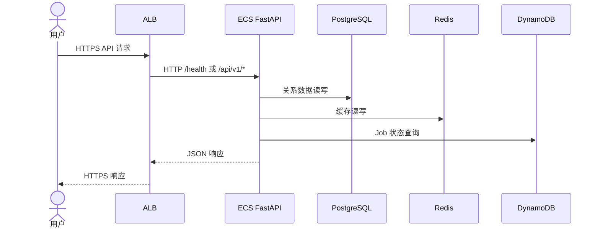
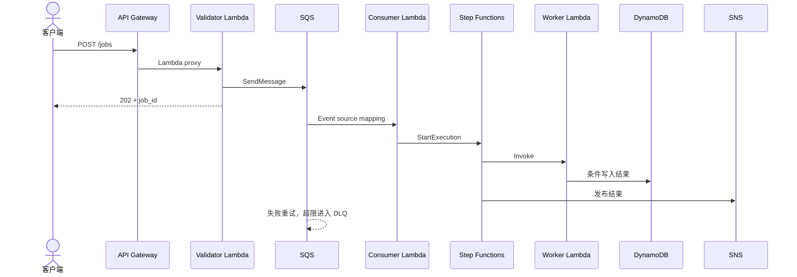

# 架构设计

## 系统背景

平台模拟一个包含静态前端、REST API、容器微服务、文件上传、异步处理、关系型/NoSQL/缓存数据层，以及安全治理和 CI/CD 的企业工作负载。目标是让学习者可以从低成本 dev 逐步开启生产能力，而不是一次部署全部资源。

## 功能需求

- 浏览器通过 HTTPS 获取静态前端并调用 API。
- 容器 API 创建 Items、提交 Jobs、生成 S3 预签名上传 URL。
- Serverless 链验证请求、入队、消费、编排、保存结果并通知。
- PostgreSQL 保存关系数据，DynamoDB 保存 Job 状态，Redis 缓存短期数据。
- 平台记录应用日志、流日志、访问日志、审计日志、指标和告警。
- dev、staging、prod 独立配置、Backend 和生命周期。

## 非功能需求

| 属性 | 设计 |
| --- | --- |
| 可用性 | 2-3 AZ；prod ECS 多 Task、每 AZ NAT、RDS/Redis Multi-AZ |
| 安全 | 最小权限 Role、私有数据层、加密、OIDC、WAF、审计 |
| 扩展性 | ECS Target Tracking、ASG 示例、Serverless 自动扩展、DynamoDB On-demand |
| 可观测性 | JSON 日志、CloudWatch Dashboard、13 类告警、Trace 扩展点 |
| 可恢复性 | S3 Versioning、RDS Backup/Final Snapshot、PITR、AWS Backup |
| 成本 | 功能开关、小规格、短日志保留、Lifecycle、单 NAT 选项 |
| 可维护性 | 领域模块、独立根模块、版本锁、CI 质量门、文档追踪 |

## 分层设计

- 边缘：Route 53、ACM、CloudFront、WAF、私有 S3。
- 网络：VPC、三类子网、路由、NAT、Endpoint、SG、NACL。
- 同步计算：Public ALB 到 Private ECS Fargate。
- 异步计算：API Gateway、Lambda、SQS/DLQ、Step Functions、SNS、EventBridge。
- 数据：RDS、DynamoDB、Redis、S3。
- 管理：IAM、KMS、Secrets Manager、Parameter Store。
- 运维：CloudWatch、CloudTrail、Config、GuardDuty、Backup。
- 交付：GitHub Actions OIDC、CodeBuild、CodePipeline。

## 网络流量路径

北南向流量：

1. 客户端到 CloudFront/WAF，再由 OAC 读取 S3。
2. 客户端到 Public ALB，再到 Private ECS。
3. 客户端到 API Gateway，再到 Lambda。

东西向流量：

1. ECS SG 到 RDS/Redis SG。
2. ECS/Lambda 到 SQS、DynamoDB、S3、Secrets Manager。
3. Private App Subnet 通过 Gateway/Interface Endpoint 访问 AWS 服务。
4. 必需公网出站通过同 AZ NAT；Database Subnet 无默认公网路由。

## 同步调用流程

## 异步调用流程

## 高可用与扩展

- Public/App/Database Subnet 跨至少两个 AZ。
- ALB 跨 AZ；ECS 使用多个 Private App Subnet。
- prod 期望至少两个 ECS Task，并允许 Target Tracking 扩展。
- RDS/Redis Multi-AZ 在 prod 开启；DynamoDB、S3、SQS/Lambda 使用区域托管可用性。
- dev 的单 NAT 或关闭 NAT 是明确成本权衡，不代表生产基线。

## 安全

数据平面默认私有；入口由 WAF/ALB/API Gateway 控制。Role 按执行主体拆分，Secret 与 Parameter 分离，State 与所有持久数据加密。审计由 CloudTrail/Config/GuardDuty 组合，细节见安全文档。

## 监控

CloudWatch 收集 ECS、Lambda、API Gateway、SQS、RDS、Redis、NAT 和 ALB 指标。Dashboard 用于总览，告警发往加密 SNS Topic。日志不记录密码、Token 或完整敏感请求。

## 灾难恢复

S3 Versioning、DynamoDB PITR、RDS Automated Backup/Final Snapshot、Redis Snapshot 与 AWS Backup 构成分层恢复。单区域实现的恢复目标受服务和配置影响，必须通过演练确认，不能只依赖 Terraform。

## 成本权衡

更高可用通常意味着每 AZ NAT、更多 Task、Multi-AZ 数据库、Interface Endpoint 和更长日志保留。开关让学习者先验证代码，再按预算启用。精确价格必须通过 AWS 官方工具确认。

## 技术选型

- ECS Fargate：避免管理容器主机，保留 ECS/IAM/网络学习价值。
- FastAPI：最小代码即可展示异步 API、类型校验和可测试性。
- HTTP API：满足简单 Lambda Proxy，成本和配置低于 REST API。
- DynamoDB On-demand：无需预测实验流量。
- S3 原生 Lockfile：当前 Terraform 推荐；避免新建已弃用的 DynamoDB 锁表。
- 独立环境目录：State、权限、变量和审批边界更清晰。

