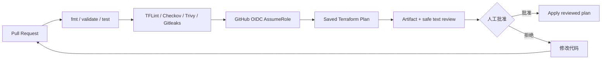

# CI/CD 流程图

```mermaid
flowchart LR
  PR["Pull Request"] --> Check["fmt / validate / test"]
  Check --> Scan["TFLint / Checkov / Trivy / Gitleaks"]
  Scan --> OIDC["GitHub OIDC AssumeRole"]
  OIDC --> Plan["Saved Terraform Plan"]
  Plan --> Review["Artifact + safe text review"]
  Review --> Approval{"人工批准"}
  Approval -->|批准| Apply["Apply reviewed plan"]
  Approval -->|拒绝| Change["修改代码"]
  Change --> PR
```

