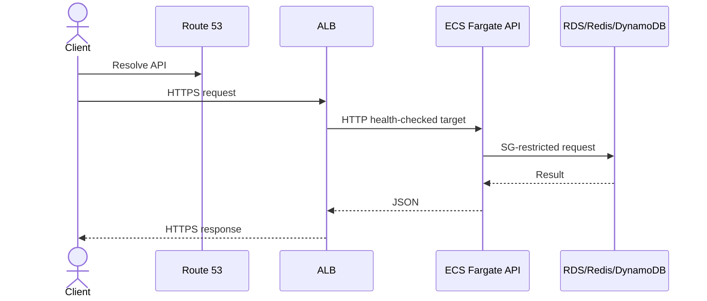

# ECS 请求流程图

```mermaid
sequenceDiagram
  actor Client
  participant DNS as Route 53
  participant ALB
  participant ECS as ECS Fargate API
  participant DB as RDS/Redis/DynamoDB
  Client->>DNS: Resolve API
  Client->>ALB: HTTPS request
  ALB->>ECS: HTTP health-checked target
  ECS->>DB: SG-restricted request
  DB-->>ECS: Result
  ECS-->>ALB: JSON
  ALB-->>Client: HTTPS response
```

