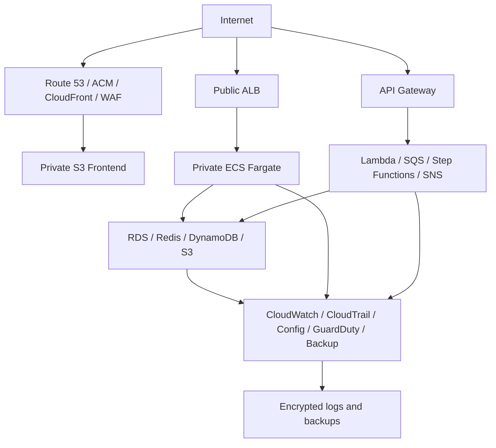

# 总体架构图

```mermaid
flowchart TB
  Internet["Internet"] --> Edge["Route 53 / ACM / CloudFront / WAF"]
  Edge --> Frontend["Private S3 Frontend"]
  Internet --> ALB["Public ALB"]
  ALB --> ECS["Private ECS Fargate"]
  ECS --> Data["RDS / Redis / DynamoDB / S3"]
  Internet --> APIGW["API Gateway"]
  APIGW --> Async["Lambda / SQS / Step Functions / SNS"]
  Async --> Data
  Ops["CloudWatch / CloudTrail / Config / GuardDuty / Backup"] --> Audit["Encrypted logs and backups"]
  Data --> Ops
  ECS --> Ops
  Async --> Ops
```

