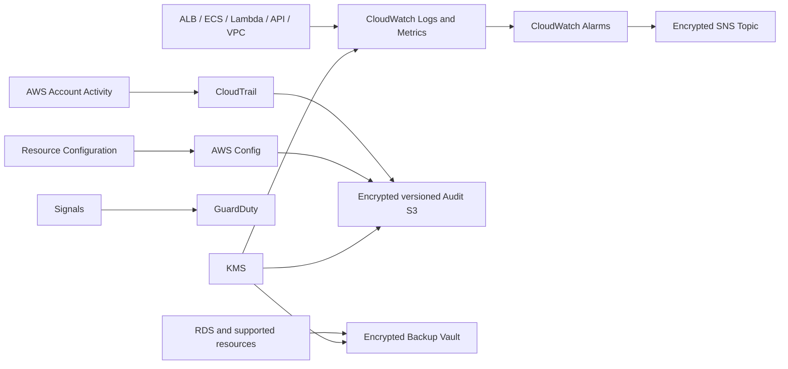

# 安全与日志关系图

```mermaid
flowchart LR
  Workloads["ALB / ECS / Lambda / API / VPC"] --> CW["CloudWatch Logs and Metrics"]
  CW --> Alarm["CloudWatch Alarms"]
  Alarm --> SNS["Encrypted SNS Topic"]
  Account["AWS Account Activity"] --> Trail["CloudTrail"]
  Resources["Resource Configuration"] --> Config["AWS Config"]
  Threats["Signals"] --> GD["GuardDuty"]
  Trail --> Audit["Encrypted versioned Audit S3"]
  Config --> Audit
  Data["RDS and supported resources"] --> Backup["Encrypted Backup Vault"]
  KMS["KMS"] --> CW
  KMS --> Audit
  KMS --> Backup
```

