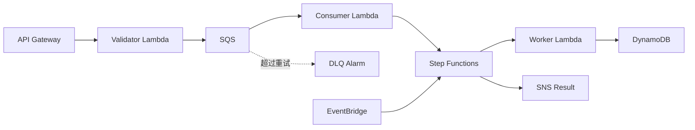

# Serverless 异步处理图

```mermaid
flowchart LR
  API["API Gateway"] --> V["Validator Lambda"]
  V --> Q["SQS"]
  Q --> C["Consumer Lambda"]
  Q -. "超过重试" .-> DLQ["DLQ Alarm"]
  C --> SFN["Step Functions"]
  SFN --> W["Worker Lambda"]
  W --> DDB["DynamoDB"]
  SFN --> SNS["SNS Result"]
  EB["EventBridge"] --> SFN
```

