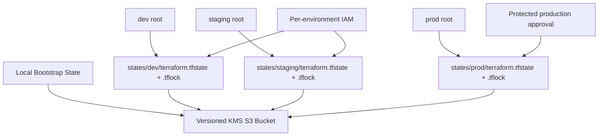

# Terraform State 管理流程图

```mermaid
flowchart TB
  Bootstrap["Local Bootstrap State"] --> S3["Versioned KMS S3 Bucket"]
  Dev["dev root"] --> DevKey["states/dev/terraform.tfstate + .tflock"]
  Stg["staging root"] --> StgKey["states/staging/terraform.tfstate + .tflock"]
  Prod["prod root"] --> ProdKey["states/prod/terraform.tfstate + .tflock"]
  DevKey --> S3
  StgKey --> S3
  ProdKey --> S3
  IAM["Per-environment IAM"] --> DevKey
  IAM --> StgKey
  Approval["Protected production approval"] --> ProdKey
```

