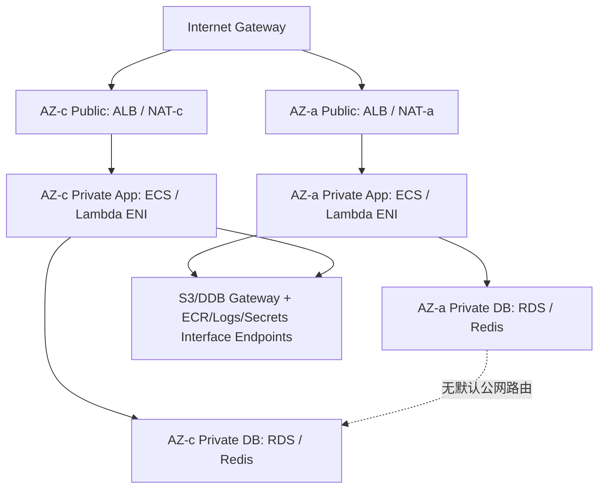

# VPC 网络图

```mermaid
flowchart TB
  IGW["Internet Gateway"] --> PubA["AZ-a Public: ALB / NAT-a"]
  IGW --> PubC["AZ-c Public: ALB / NAT-c"]
  PubA --> AppA["AZ-a Private App: ECS / Lambda ENI"]
  PubC --> AppC["AZ-c Private App: ECS / Lambda ENI"]
  AppA --> DbA["AZ-a Private DB: RDS / Redis"]
  AppC --> DbC["AZ-c Private DB: RDS / Redis"]
  AppA --> EP["S3/DDB Gateway + ECR/Logs/Secrets Interface Endpoints"]
  AppC --> EP
  DbA -. "无默认公网路由" .-> DbC
```

